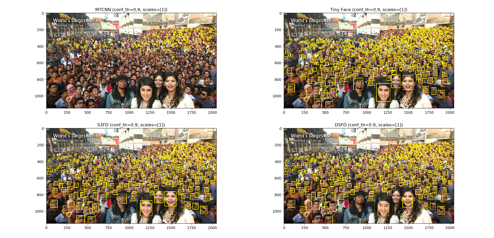

## Face Detection
PyTorch implementations of various face detection algorithms (last updated on 2019-08-03).

### Usage Example
```python
import cv2, random
from detectors import DSFD
from utils import draw_bboxes, crop_thumbnail, draw_bbox

# load detector with device(cpu or cuda)
DET = DSFD(device='cpu')

# load image in RGB
img = cv2.imread('bts.jpg')
img = cv2.cvtColor(img, cv2.COLOR_BGR2RGB)

# get bboxes with some confidence in scales for image pyramid
bboxes = DET.detect_faces(img, conf_th=0.9, scales=[0.5, 1])

# and draw bboxes on your image
img_bboxed = draw_bboxes(img, bboxes, fill=0.2, thickness=3)

# or crop thumbnail of someone
i = random.randrange(0, len(bboxes))
img_thumb, bbox_thumb = crop_thumbnail(img, bboxes[i], padding=1, size=100)

# you can use 'bbox_thumb' as bbox in thumbnail-coordinate system.
img_thumb_bboxed = draw_bbox(img_thumb, bbox_thumb)
```

### Weight Files
* MTCNN
```
./detectors/mtcnn/weights/pnet.npy
./detectors/mtcnn/weights/rnet.npy
./detectors/mtcnn/weights/onet.npy
```
* FaceBoxes
```
./detectors/faceboxes/weights/FaceBoxes.pth
```
* [Tiny Face (trained on WIDER FACE)](https://drive.google.com/open?id=1vdKzrfQ4cXeI157NEJoeI1ECZ66GFEKE)
```
./detectors/tinyface/weights/checkpoint_50.pth
```
* [PyramidBox (trained on WIDER FACE)](https://drive.google.com/open?id=1jLHIwN15u73qr-8rmthZEZWQfnAq6N9C)
```
./detectors/pyramidbox/weights/pyramidbox_120000_99.02.pth
```
* [S3FD (trained on WIDER FACE)](https://drive.google.com/open?id=1ktVh55p-Ynu6LonSyZtaUJxU23BS0Pdk)
```
./detectors/s3fd/weights/sfd_face.pth
``` 
* [DSFD (trained on WIDER FACE)](https://drive.google.com/open?id=1ZVzJqbjoymnKl11jDc-VGkVgzBqR3rZZ)
```
./detectors/dsfd/weights/dsfd_vgg_0.880.pth
```

### Demo 01 : detect
```
python demo_detect.py
```


Note that it shows bounding boxes only for default scale image *without image pyramid*. Number of bounding boxes ─ not detected faces ─ and minimum box sizes are as follows:

|                    | MTCNN | FaceBoxes | Tiny face | PyramidBox |  S3FD  |  DSFD  |
|         -          |   -   |     -     |     -     |     -      |    -   |    -   |
|     # of boxes     |  210  |     28    |    686    |    512     |   475  |  528   |
|  minimum box size  |   71  |   1136    |    138    |    109     |   108  |  113   |
|  minimum box size  | 1046  |  27901    |  36912    |  24059     |  26711 |  15814 |

### Demo 02 : crop
```
python demo_crop.py
```


### Face Size
* Minimum and maximum lengths of detected boxes are as follows:

|                    | MTCNN | Tiny face | S3FD  | DSFD  |
|         -          |   -   |     -     |   -   |   -   |
| min length (pixel) | 000.0 |   000.0   | 000.0 | 000.0 |
| max length (pixel) | 000.0 |   000.0   | 000.0 | 000.0 |

### References
* MTCNN
    * [arXiv : Joint Face Detection and Alignment using Multi-task Cascaded Convolutional Networks](https://arxiv.org/abs/1604.02878)
    * [GitHub : mtcnn-pytorch](https://github.com/TropComplique/mtcnn-pytorch)
* FaceBoxes
    * [arXiv : FaceBoxes: A CPU Real-time Face Detector with High Accuracy](https://arxiv.org/abs/1708.05234)
    * [GitHub : FaceBoxes.PyTorch](https://github.com/zisianw/FaceBoxes.PyTorch)
* Tiny Face
    * [arXiv : Finding Tiny Faces](https://arxiv.org/abs/1612.04402)
    * [GitHub : tiny-faces-pytorch](https://github.com/varunagrawal/tiny-faces-pytorch)
* PyramidBox
    * [arXiv : PyramidBox: A Context-assisted Single Shot Face Detector](https://arxiv.org/abs/1803.07737)
    * [GitHub : Pyramidbox.pytorch](https://github.com/yxlijun/Pyramidbox.pytorch)
* S3FD
    * [arXiv : S³FD: Single Shot Scale-invariant Face Detector](https://arxiv.org/abs/1708.05237)
    * [GitHub : S3FD.pytorch](https://github.com/yxlijun/S3FD.pytorch)
* DSFD
    * [arXiv : DSFD: Dual Shot Face Detector](https://arxiv.org/abs/1810.10220)
    * [GitHub : DSFD.pytorch](https://github.com/yxlijun/DSFD.pytorch)
    * [GitHub : FaceDetection-DSFD](https://github.com/TencentYoutuResearch/FaceDetection-DSFD)
